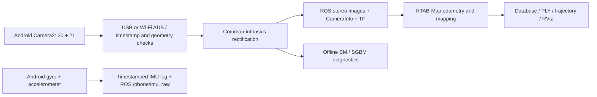

# Phone Stereo SLAM

**Two phone cameras → USB or Wi-Fi stereo stream → ROS 2 / RTAB-Map → inspectable 3D maps.**

A research prototype using the telephoto and ultrawide rear cameras of a Xiaomi Mi 9T Pro. It includes camera acquisition, cached-corner calibration, stereo diagnostics, recorded/live ROS input, map export, and a desktop control panel.

**Status:** the end-to-end mapping pipeline runs on recorded data. Room-scale accuracy and robot-mounted operation are not yet validated. Some maps are fragmented and dense clouds contain visible artifacts. Point count and valid-disparity coverage are not accuracy measurements.

## What works

| Capability | Evidence / boundary |
|---|---|
| Independent cameras 20 + 21 | Physically identified on one Mi 9T Pro, Android 11; portability to other phones is unknown |
| Timestamped stereo over USB | Exact image/capture metadata join; pairs within 20 ms; no hardware exposure synchronization |
| Wi-Fi image transport | The latest 90 s moving Wi-Fi session captured 870 stereo pairs and published 854 online depth frames; the scene remains too narrow for a complete room map |
| Phone inertial stream | Raw gyro/accelerometer samples are timestamped, logged, and gyro is published as `/phone/imu_raw`; a 7 s device check recorded 353 samples of each with zero phone-buffer drops. Sensor fusion is pending camera–IMU alignment and bias validation |
| Calibration | 27 training and 10 held-out poses; vertical-error p95 1.451 px on those poses |
| ROS 2 mapping | Latest 90 s Wi-Fi run yielded 30 connected poses / 63,365 exported points. The view remains a nearby-furniture section, not a validated room map |
| Saved-map localization | The stored map, live path, and current odometry pose can be shown in RViz. Same-recording replay produced 10 accepted map matches; a separate earlier room recording produced 0, so cross-session relocalization is unverified |
| Session lifecycle | Source and mapper process groups shut down before export; tracking loss preserves raw capture and rejects the interrupted map |
| Tracking-loss salvage | Separate pre/post-loss raw sections can be exported as independent ROS maps; no unverified pose bridge or automatic relocalization |
| Online SGBM depth | Explicit live/replay option; latest 90 s moving phone/Wi-Fi/ROS2 run published 895 depth frames from 906 stereo pairs |
| Map inspection | PLY, trajectory, RViz topics, and separately labeled disconnected components |
| Reproducible diagnostics | Actual matcher settings, LR-stage counts, input hashes, per-frame outputs |

The [recorded depth consistency audit](docs/DEPTH_CONSISTENCY.md) compares identical optical tracks across SGBM and learned depth. It also exposed an odometry/image timestamp mismatch: the updated hybrid path retained the previously omitted motion interval. [Measured hybrid results and remaining limitations](docs/RGBD_MAPPING.md).

The [live 3D status and localization audit](docs/LIVE_3D_STATUS_TR.md) records the latest map, path, and replay measurements. Independent geometry, room coverage and cross-session localization remain unverified.

The desktop panel also provides a separate, guided **3-minute whole-room capture**. A later 90 s recording retained all 981 stereo pairs but lost SGBM tracking about 29 s into capture in a dark scene; its first safe section produced a separate 7-pose offline map. The remaining section is retained without asserting one continuous room map. See [the Wi-Fi ROS guide](docs/ROS_WIFI_TR.md).

[Online SGBM operation and load test](docs/ONLINE_SGBM.md): depth is now computed from the incoming ROS stereo stream. The panel includes an explicit experimental SGBM scan button and a camera-free SGBM replay button.

Held-out camera-21 corners cover only the central part of its image. The local author's calibration has an **approximate ruler-derived** 21.44 mm checker-square sidecar; this does not validate map geometry. New calibrations need their own physical scale. See [evaluation protocol](docs/EVALUATION.md) before interpreting a map as usable robot geometry.

## Architecture



Early RTAB-Map stereo recordings used **StereoBM**; the latest hybrid ROS2 session uses online controlled **SGBM** depth. The local depth viewer is another path. Results from one mode must not be attributed to another.

## Quick start: tests without a phone

Python 3.10 on Linux:

```bash
python3 -m venv .venv
.venv/bin/python -m pip install -r host/requirements.txt
.venv/bin/python -m unittest discover -s tests -v
```

ROS-message tests skip when ROS is unavailable. CI checks the source tests; it does not certify camera hardware, mapping accuracy, or GPU inference.

## Camera capture and calibration

Prerequisites: Ubuntu, JDK 11, adb, Python/Tk, curl/unzip and an Android phone with authorized USB debugging.

```bash
scripts/setup.sh
scripts/build.sh testDebugUnitTest
adb install -r android/app/build/outputs/apk/debug/app-debug.apk
scripts/start_assistant.sh
```

The assistant guides target observations and preserves selected poses. The calibration gate is not relaxed for mapping. This specific camera combination was tested; starting arbitrary hidden camera IDs is not a portability strategy. See [reproduction notes](docs/REPRODUCE.md).

## ROS 2 mapping

Install ROS 2 Humble and `ros-humble-rtabmap-ros` on Ubuntu 22.04. ROS tools use the system Python and its NumPy/OpenCV, independently of the pinned offline virtual environment. A compatible local calibration is required; private calibration/capture files are not included in the source repository.

```bash
# Desktop panel; opening it does not start the cameras.
scripts/start_ros_dashboard.sh

# Completed, validated recording -> bag. Supply your actual paths and scale.
source /opt/ros/humble/setup.bash
python3 -m host.ros_stereo --trial data/my-recording \
  --calibration data/my-calibration/calibration.npz \
  --square-mm 25 --output data/ros/my-recording

# Recorded input, no phone required.
scripts/start_ros_replay.sh --bag data/ros/my-recording
```

`--square-mm 25` is an example **measured** size, not the size of the author's target. For an explicitly estimated scale use `--estimated-square-mm`; exports retain that provenance. The bundled live launcher uses the author's local calibration-bound scale sidecar and camera settings, so it must be adapted to a different calibration/device. [Turkish operating guide](docs/ROS_3D_MAPPING_TR.md).

Each session receives its own directory. `map/map.db` is the database; `export/map_cloud.ply` and `map_poses.txt` are the cloud and poses. `summary.json`, `lifecycle.json`, and `export-result.json` distinguish connected, partial, failed, and interrupted results. Failed export attempts are retained and can be retried.

The [Wi-Fi ROS guide](docs/ROS_WIFI_TR.md) opens the desktop panel over a selected wireless ADB link. It includes a 30-second camera-only preview to check scene brightness and detail before mapping. A measured 15-second Wi-Fi run delivered stereo, ROS images, online SGBM depth and tracking; the stationary dark view produced only one map pose, so wireless room mapping remains unvalidated.

During an SGBM session, **Anlık 3B derinlik (RViz)** opens `/phone/local_cloud`: metric points from the current stereo pair in `phone_left_optical`. This moving, camera-relative view does not accumulate a room map. **Biriken ROS haritası (RViz)** opens RTAB-Map's `/rtabmap/cloud_map` in `map`. The desktop panel keeps a provisional RTAB-Map stream visible after tracking loss, records the loss, and saves only a clearly labeled diagnostic fragment; it does not accept the session as a continuous robot map. A recorded-room replay produced a 75-pose, 232,317-point connected diagnostic fragment and published accumulated cloud messages while running. See [live 3D status](docs/LIVE_3D_STATUS_TR.md).

For new recordings, a tracking-loss session retains source images and records a timestamp-based recovery plan. [`ros_recovery_segments`](docs/ROS_RECOVERY_SEGMENTS_TR.md) copies safe pre/post-loss sections into new directories; `host.ros_recovery_map` processes those sections sequentially as **independent** ROS maps. Older recordings without the exact ROS/source timestamp offset are not split automatically. Neither step joins the maps or certifies a robot-ready trajectory.

## Stereo / heterogeneous-lens benchmark

```bash
python3 -m host.stereo_benchmark \
  --trial work/my-completed-recording \
  --calibration data/my-calibration/calibration.npz \
  --output work/benchmark-new
```

The benchmark selects equally spaced frames within each recorded phase before examining results. It evaluates fixed regions and illumination/sampling ablations, saves actual matcher getter values and both disparity maps, and checks input hashes. Output directories must be new. Full raw evidence remains local. [Measured results](docs/BENCHMARK_RESULTS.md) · [Method and interpretation](docs/EVALUATION.md).

## Experimental monocular depth

An optional local **Depth Anything V2 Metric Hypersim Small** adapter and recorded-data comparator are available. It predicts dense depth from one rectified camera image. Output is model-predicted metres, not validated metric geometry; it is not enabled in the live mapper. A [recorded hybrid path](docs/RGBD_MAPPING.md) retains stereo odometry while mapping precomputed model or SGBM surfaces. [Setup, measured results and limitations](docs/DEPTH_ANYTHING.md).

## Development and release

- `android/`: Camera2 acquisition and bounded stereo transport.
- `host/`: calibration, depth, ROS lifecycle, map tools and offline evaluation.
- `tests/`: geometry, timing, process cleanup, exports, and synthetic regressions.
- `configs/`: calibration guidance and RViz display configuration.
- `docs/`: measurement boundaries and reproduction instructions.

Use the [public source export procedure](docs/PUBLICATION.md) to prepare a source-only ZIP. Captures, maps, local logs, machine paths, credentials, and model weights are excluded. There is currently no project-wide license grant; third-party code and model terms remain separate.
